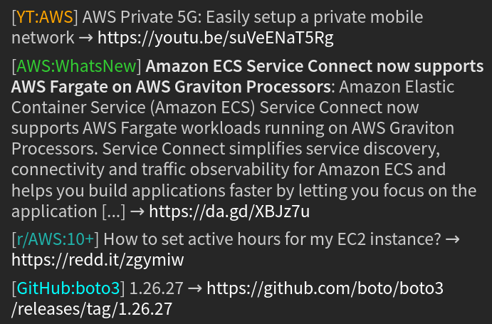

# irc-rss-feed-bot
**irc-rss-feed-bot** is a dockerized Python 3.9 and IRC based RSS/Atom and scraped HTML/JSON/CSV feed posting bot.
It essentially posts the entries of feeds in IRC channels, one entry per message.
More specifically, it posts the titles and shortened URLs of entries.

If viewing this readme on Docker Hub, note that it may be misformatted.
In this case, it can be viewed correctly on [GitHub](https://github.com/impredicative/irc-rss-feed-bot).

## Contents
- [Features](#features)
- [Links](#links)
- [Examples](#examples)
- [Usage](#usage)
  * [Configuration: secret](#configuration-secret)
  * [Configuration: non-secret](#configuration-non-secret)
    + [Global settings](#global-settings)
      - [Mandatory](#mandatory)
      - [Recommended](#recommended)
      - [Developer](#developer)
    + [Feed-specific settings](#feed-specific-settings)
      - [Mandatory](#mandatory-1)
      - [Optional](#optional)
      - [Parser](#parser)
      - [Conditional](#conditional)
    + [Feed default settings](#feed-default-settings)
  * [Commands](#commands)
    + [Administrative](#administrative)
    + [General](#general)
- [Deployment](#deployment)
- [Maintenance](#maintenance)
  * [Service](#service)
  * [Config](#config)
  * [Database](#database)
  * [Disk cache](#disk-cache)

## Features
* Multiple channels on an IRC server are supported, with each channel having its own set of feeds.
For use with multiple servers, a separate instance of the bot process can be run for each server.
* Entries are posted only if the channel has not had any conversation for a certain minimum amount of time, 
thereby avoiding the interruption of any preexisting conversations.
This amount of time is 15 minutes for any feed which has a polling period greater than 12 minutes.
There is however no delay for any feed which has a polling period less than or equal to 12 minutes as such a feed is
considered urgent.
* A SQLite database file records hashes of the entries that have been posted, thereby preventing them from being
reposted.
* The [`hext`](https://pypi.org/project/hext/), [`jmespath`](https://pypi.org/project/jmespath/), and 
[`pandas`](https://pandas.pydata.org/) DSLs are supported for flexibly parsing arbitrary HTML, JSON, and CSV content 
respectively. These parsers also support configurable recursive crawling.
* Entry titles are formatted for neatness.
Any HTML tags and excessive whitespace are stripped, all-caps are replaced,
and excessively long titles are sanely truncated. 
* A TTL and ETag based compressed disk cache of URL content is used for preventing unnecessary URL reads.
Any websites with a mismatched _strong_ ETag are probabilistically detected, and this caching is then disabled for them
for the duration of the process. Note that this detection is skipped for a _weak_ ETag.
* Encoded Google News and FeedBurner URLs are decoded.

For several more features, see the customizable [global](#global-settings) and [feed-specific](#feed-specific-settings) settings, and [commands](#commands).

## Links
| Caption   | Link                                                       |
|-----------|------------------------------------------------------------|
| Repo      | https://github.com/impredicative/irc-rss-feed-bot          |
| Changelog | https://github.com/impredicative/irc-rss-feed-bot/releases |
| Image     | https://hub.docker.com/r/ascensive/irc-rss-feed-bot        |
| Donation  | [BTC](https://blockchair.com/bitcoin/address/bc1q05p96m0s9kqe9c67jq87sjsnuv6vmzeuxea872) / [LTC](https://blockchair.com/litecoin/address/ltc1q95jq6j78kvyfrvxalwgt9m9xhj9f4r7jfwrqth) / [ETH](https://blockchair.com/ethereum/address/0x0d2d5c576af8ed9f3833f4a3b1e4de6cac2285f0) / [DOGE](https://blockchair.com/dogecoin/address/D5atn8Q9f5iBXrWByxW3i3483QFNH4RFnP) |

## Examples
```text
<Feed[bot]> [ArXiv:cs.AI] Concurrent Meta Reinforcement Learning → https://arxiv.org/abs/1903.02710v1
<Feed[bot]> [ArXiv:cs.AI] Attack Graph Obfuscation → https://arxiv.org/abs/1903.02601v1
<Feed[bot]> [InfoWorld] What is a devops engineer? And how do you become one? → https://j.mp/2NOgQ3g
<Feed[bot]> [InfoWorld] What is Jupyter Notebook? Data analysis made easier → https://j.mp/2NMailP
<Feed[bot]> [AWS:OpenData] COVID-19 Open Research Dataset (CORD-19): Full-text and metadata dataset of
            COVID-19 research articles. → https://registry.opendata.aws/cord-19
```


## Usage
### Configuration: secret
Prepare a private `secrets.env` environment file using the sample below.
```ini
IRC_PASSWORD=YourActualPassword
BITLY_TOKENS=5e71a58b19582f48edcb0235637ac3536dd3b6dc,bd90119a7b617e81b293ddebbbfed3e955eac5af,42f309642a018e6b4d7cfba6854080719dccf0cc,0819552eb8b42e52dbc8b4c3e1654f5cd96c0dcc
GITHUB_TOKEN=c81a62ca23caa140715bbfc175997c02d0fdd768
```

#### BITLY_TOKENS
[Bitly](https://nullrefer.com/?https://bitly.com/) tokens are required for shortening URLs.
URL shortening is enabled for all feeds by default but can be disabled selectively per feed.
The sample tokens above are for illustration only and are invalid.
To obtain tokens, refer to [these instructions](https://github.com/impredicative/bitlyshortener#usage).
Providing multiple comma-separated tokens, perhaps as many as 40 free ones or sufficient commercial ones, is required.
Failing this, Bitly imposed rate limits for shortening URLs will lead to errors.
If there are errors, the batched new entries in a feed may get reprocessed the next time the feed is read.
It is safer to provide more tokens than are necessary.

#### GITHUB_TOKEN
Refer to the optional `publish.github` feature.

### Configuration: non-secret
Prepare a version-controlled `config.yaml` file using the sample below.
A full-fledged real-world example is also
[available](https://github.com/impredicative/irc-bots/blob/master/freenode/feed-bot/config.yaml).
```yaml
host: chat.freenode.net
ssl_port: 6697
nick: MyFeed[bot]
admin: mynick!myident@myhost
alerts_channel: '##mybot-alerts'
mirror: '##mybot-mirror'
mode:
publish:
  github: MyGithubServiceAccountUsername/IrcServerName-MyBotName-live
defaults:
  new: all
feeds:
  "##mybot-alerts":
    irc-rss-feed-bot:
      url: https://github.com/impredicative/irc-rss-feed-bot/releases.atom
      period: 12
      shorten: false
  "#some_chan1":
    AWS:OpenData:
      url: https://registry.opendata.aws/rss.xml
      message:
        summary: true
    j:AJCN:
      url: https://academic.oup.com/rss/site_6122/3981.xml
      mirror: false
      period: 12
      blacklist:
        title:
          - ^Calendar\ of\ Events$
    LitCovid:
      url: https://www.ncbi.nlm.nih.gov/research/coronavirus-api/export
      pandas: |-
        read_csv(file, comment="#", sep="\t") \
        .assign(link=lambda r: "https://pubmed.ncbi.nlm.nih.gov/" + r["pmid"].astype("str")) \
        .convert_dtypes()
    MedicalXpress:nutrition:
      url: https://medicalxpress.com/rss-feed/search/?search=nutrition
    r/FoodNerds:
      url: https://www.reddit.com/r/FoodNerds/new/.rss
      shorten: false
      sub:
        url:
          pattern: ^https://www\.reddit\.com/r/.+?/comments/(?P<id>.+?)/.+$
          repl: https://redd.it/\g<id>
  "##some_chan2":
    ArXiv:cs.AI: &ArXiv
      url: http://export.arxiv.org/rss/cs.AI
      period: 1.5
      https: true
      shorten: false
      group: ArXiv:cs
      alerts:
        empty: false
      format:
        re:
          title: '^(?P<name>.+?)\.?\ \(arXiv:.+(?P<ver>v\d+)\ '
        str:
          title: '{name}'
          url: '{url}{ver}'
    ArXiv:cs.NE:
      <<: *ArXiv
      url: http://export.arxiv.org/rss/cs.NE
    ArXiv:stat.ML:
      <<: *ArXiv
      url: http://export.arxiv.org/rss/stat.ML
      group: null
    AWS:status:
      url: https://status.aws.amazon.com/rss/all.rss
      period: .2
      https: true
      new: none
      sub:
        title:
          pattern: ^(?:Informational\ message|Service\ is\ operating\ normally):\ \[RESOLVED\]
          repl: '[RESOLVED]'
      format:
        re:
          id: /\#(?P<service>[^_]+)
        str:
          title: '[{service}] {title} | {summary}'
          url: '{id}'
    Fb:Research:
      url: https://research.fb.com/publications/
      hext: |-
        <div>
            <a href:link><h3 @text:title/></a>
            <div class="areas-wrapper"><a href @text:category/></div>
        </div>
        <div><form class="download-form" action/></div>
      whitelist:
        category:
          - ^(?:Facebook\ AI\ Research|Machine\ Learning|Natural\ Language\ Processing\ \&\ Speech)$
    InfoWorld:
      url: https://www.infoworld.com/index.rss
      order: reverse
    j:MDPI:N:  # https://www.mdpi.com/journal/nutrients (open access)
      url: https://www.mdpi.com/rss/journal/nutrients
      www: false
    KDnuggets:
      url: https://us-east1-ml-feeds.cloudfunctions.net/kdnuggets
      new: some
    libraries.io/pypi/scikit-learn:
      url: https://libraries.io/pypi/scikit-learn/versions.atom
      new: none
      period: 8
      shorten: false
    MedRxiv:
      url:
        - https://connect.medrxiv.org/medrxiv_xml.php?subject=Health_Informatics
        - https://connect.medrxiv.org/medrxiv_xml.php?subject=Nutrition
      alerts:
        read: false
      https: true
    r/MachineLearning:100+:
      url: https://www.reddit.com/r/MachineLearning/hot/.json?limit=50
      jmespath: 'data.children[*].data | [?score >= `100`].{title: title, link: join(``, [`https://redd.it/`, id])}'
      shorten: false
    r/wallstreetbets:50+:
      url: https://www.reddit.com/r/wallstreetbets/hot/.json?limit=98
      jmespath: 'data.children[*].data | [?(not_null(link_flair_text) && score >= `50`)].{title: join(``, [`[`, link_flair_text, `] `, title]), link: join(``, [`https://redd.it/`, id]), category: link_flair_text}'
      emoji: false
      shorten: false
      blacklist:
        category:
          - ^(?:Daily\ Discussion|Gain|Loss|Meme|Weekend\ Discussion|YOLO)$
    PwC:Latest:
      url: https://us-east1-ml-feeds.cloudfunctions.net/pwc/latest
      period: 0.5
      dedup: channel
    PwC:Trending:
      url: https://us-east1-ml-feeds.cloudfunctions.net/pwc/trending
      period: 0.5
      dedup: channel
    SeekingAlpha:
      period: 0.2
      sub:
        url:
          pattern: ^(?P<main_url>https://seekingalpha\.com/[a-z]+/[0-9]+).*$
          repl: \g<main_url>
      shorten: false
      topic:
        "Daily calendar": \b(?i:economic\ calendar)\b
        "Daily prep": '^Wall\ Street\ Breakfast:\ '
        "Hourly status": ^On\ the\ hour$
      url:
        - https://seekingalpha.com/market_currents.xml
        - https://seekingalpha.com/feed.xml
        - https://seekingalpha.com/tag/etf-portfolio-strategy.xml
        - https://seekingalpha.com/tag/wall-st-breakfast.xml
    SSRN:
      url: https://papers.ssrn.com/sol3/Jeljour_results.cfm?form_name=journalBrowse&journal_id=3526423&Network=no&lim=false&npage=1
      hext:
        select: <a href:link href^="https://ssrn.com/abstract=" @text:title />
        follow: <a class="jeljour_pagination_number" @text:prepend("https://papers.ssrn.com/sol3/Jeljour_results.cfm?form_name=journalBrowse&journal_id=3526423&Network=no&lim=false&npage="):url/>
      period: 6
    TalkRL:
      url: https://www.talkrl.com/feed
      period: 8
      message:
        title: false
        summary: true
    YT:3Blue1Brown: &YT
      url: https://www.youtube.com/feeds/videos.xml?channel_id=UCYO_jab_esuFRV4b17AJtAw
      period: 12
      shorten: false
      style:
        name:
          bg: red
          fg: white
          bold: true
      sub:
        url:
          pattern: ^https://www\.youtube\.com/watch\?v=(?P<id>.+?)$
          repl: https://youtu.be/\g<id>
    YT:AGI:
      url: https://www.youtube.com/results?search_query=%22artificial+general+intelligence%22&sp=CAISBBABGAI%253D
      hext: <a href:filter("/watch\?v=(.+)"):prepend("https://youtu.be/"):link href^="/watch?v=" title:title/>
      period: 12
      shorten: false
      alerts:
        emptied: true
      blacklist:
        title:
          - \bWikipedia\ audio\ article\b
    YT:LexFridman:
      <<: *YT
      url: https://www.youtube.com/feeds/videos.xml?channel_id=UCSHZKyawb77ixDdsGog4iWA
      whitelist:
        title:
          - \bAGI\b
```

#### Global settings

##### Mandatory
* **`host`**: IRC server address.
* **`ssl_port`**: IRC server SSL port.
* **`nick`**: This is a registered IRC nick. If the nick is in use, it will be regained.
Ensure that the email verification of the registered nick, as applicable to many IRC servers, is complete.
Without this email verification, the bot can fail to receive the required event 900 and therefore fail to function.

##### Recommended
* **`admin`**: Administrative commands by this user pattern are accepted and executed.
Its format is `nick!ident@host`. An example is `JDoe11!sid654321@gateway/web/irccloud.com/x-*`.
A case-insensitive pattern match is tested for using [`fnmatch`](https://docs.python.org/3/library/fnmatch.html).
* **`alerts_channel`**: Some but not all warning and error alerts are sent to this channel.
Its default value is `##{nick}-alerts`. The key `{nick}`, if present in the value, is formatted with the actual nick.
For example, if the nick is `MyFeed[bot]`, alerts will by default be sent to `##MyFeed[bot]-alerts`.
Since a channel name starts with #, the name if provided **must be quoted**.
It is recommended that the alerts channel be registered and monitored.
* **`mode`**: This can for example be `+igR` for [Freenode](https://freenode.net/kb/answer/usermodes) 
and `+igpR` for [Rizon](https://wiki.rizon.net/index.php?title=User_Modes).
  
##### Optional
* **`mirror`**: If specified as a channel name, all posts across all channels are mirrored to this channel.
This however doubles the time between consecutive posts in any given channel.
Mirroring can however individually be disabled for a feed by setting `<feed>.mirror`.
* **`publish.github`**: This is the username and repo name of a GitHub repo, e.g. [`feedarchive/freenode-feedbot-live`](https://github.com/feedarchive/freenode-feedbot-live).
All posts are published to the repo, thereby providing a basic option to archive and search them.
A new CSV file is written to the repo for each posted feed having one or more new posts.
Basic search functionality is provisioned via a `search` [command](#commands).
The following requirements apply:
  * The repo must exist; it is not created by the bot. It is recommended that an empty new repo is used.
If the repo is of public interest, it can be requested to be moved into the [`feedarchive`](https://github.com/feedarchive) organization by filing an issue.
  * The GitHub user must have access to write to the repo. It is recommended that a dedicated new service account be used, not your primary user account.
  * A GitHub [personal access token](https://github.com/settings/tokens) is required with access to the entire `repo` and `gist` scopes.
The `repo` scope is used for making commits. The `gist` scope is used for sharing search results.
The token is provisioned for the bot via the `GITHUB_TOKEN` secret environment variable.

##### Developer
* **`log.irc`**: If `true`, low level IRC events are logged by `miniirc`. These are quite noisy. Its default is `false`.
* **`once`**: If `true`, each feed is queued only once. It is for testing purposes. Its default is `false`.
* **`tracemalloc`**: If `true`, memory allocation tracing is enabled. The top usage and positive-diff statistics are then logged hourly.
It is for diagnostic purposes. Its default is `false`.

#### Feed-specific settings
A feed is defined under a channel as in the sample configuration. The feed's key represents its name.

The order of execution of the interacting operations is:
`blacklist`, `whitelist`, `https`, `www`, `emoji`, `sub`, `format`, `shorten`.
Refer to the sample configuration for usage examples.

YAML [anchors and references](https://en.wikipedia.org/wiki/YAML#Advanced_components) can be used to reuse nodes.
Examples of this are in the sample.

##### Mandatory
* **`<feed>.url`**: This is either a single URL or a list of URLs of the feed.
If a list, the URLs are read in sequence with an interval of one second between them.

##### Optional
These are optional and are independent of each other:
* **`<feed>.alerts.empty`**: If `true`, an alert is sent if any source URL of the feed has no entries before their validation. 
If `false`, such an alert is not sent. Its default value is `true`.
* **`<feed>.alerts.emptied`**: If `true`, an alert is sent if the feed has entries before but not after their validation.
If `false`, such an alert is not sent. Its default value is `false`.
* **`<feed>.alerts.read`**: If `true`, an alert is sent if an error occurs three or more consecutive times 
when reading or processing the feed, but no more than once every 15 minutes.
If `false`, such an alert is not sent. Its default value is `true`.
* **`<feed>.blacklist.category`**: This is an arbitrarily nested dictionary or list or their mix of regular 
expression patterns that result in an entry being skipped if a 
[search](https://docs.python.org/3/library/re.html#re.search) finds any of the patterns in any of the categories of the 
entry.
The nesting permits lists to be creatively reused between feeds via YAML anchors and references.
* **`<feed>.blacklist.title`**: This is an arbitrarily nested dictionary or list or their mix of regular 
expression patterns that result in an entry being skipped if a 
[search](https://docs.python.org/3/library/re.html#re.search) finds any of the patterns in the title.
The nesting permits lists to be creatively reused between feeds via YAML anchors and references.
* **`<feed>.blacklist.url`**: Similar to `<feed>.blacklist.title`.
* **`<feed>.dedup`**: This indicates how to deduplicate posts for the feed, thereby preventing them from being 
reposted.
The default value is `feed` (per-feed per-channel), and an alternate possible value is `channel` (per-channel).
* **`<feed>.emoji`**: If `false`, emojis in entry titles are removed. Its default value is `null`.
* **`<feed>.group`**: If a string, this delays the processing of a feed that has just been read until all 
other feeds having the same group are also read.
This encourages multiple feeds having the same group to be be posted in succession, except if interrupted by
conversation.
It is however possible that unrelated feeds of any channel gets posted between ones having the same group.
To explicitly specify the absence of a group when using a YAML reference, the value can be specified as `null`.
It is recommended that feeds in the same group have the same `period`.
* **`<feed>.https`**: If `true`, entry links that start with `http://` are changed to start with `https://` 
instead. Its default value is `false`.
* **`<feed>.message.summary`**: If `true`, the entry summary (description) is included in its message.
The entry title, if included, is then formatted bold.
This is applied using IRC formatting if a `style` is defined for the feed, otherwise using unicode formatting.
The default value is `false`.
* **`<feed>.message.title`**: If `false`, the entry title is not included in its message.
Its default value is `true`.
* **`<feed>.mirror`**: If `false`, mirroring is disabled for this feed. 
  Its default value is `true`, subject to the global-setting for mirroring.
* **`<feed>.new`**: This indicates up to how many entries of a new feed to post.
A new feed is defined as one with no prior posts in its channel.
The default value is `some` which is interpreted as 3.
The default is intended to limit flooding a channel when one or more new feeds are added.
A string value of `none` is interpreted as 0 and will skip all entries for a new feed.
A value of `all` will skip no entries for a new feed; it is not recommended and should be used sparingly if at all.
In any case, future entries in the feed are not affected by this option on subsequent reads,
and they are all forwarded without a limit.
* **`<feed>.order`**: If `reverse`, the order of the entries is reversed.
* **`<feed>.period`**: This indicates how frequently to read the feed in hours on an average.
Its default value is 1.
Conservative polling is recommended. Any value below 0.2 is changed to a minimum of 0.2.
Note that 0.2 hours is equal to 12 minutes.
To make service restarts safer by preventing excessive reads, the first read is delayed by half the period.
To better distribute the load of reading multiple feeds, a uniformly distributed random ±5% is applied to the period for
each read.
* **`<feed>.shorten`**: This indicates whether to post shortened URLs for the feed.
The default value is `true`.
The alternative value `false` is recommended if the URL is naturally small, or if `sub` or `format` can be used to make
it small.
* **`<feed>.style.name.bg`**: This is a string representing the name of a background color applied to the 
feed's name.
It can be one of: white, black, blue, green, red, brown, purple, orange, yellow, lime, teal, aqua, royal, pink, grey,
silver. The channel modes must allow formatting for this option to be effective.
* **`<feed>.style.name.bold`**: If `true`, bold formatting is applied to the feed's name. 
Its default value is `false`.
The channel modes must allow formatting for this option to be effective.
* **`<feed>.style.name.fg`**: Foreground color similar to `<feed>.style.name.bg`.
* **`<feed>.topic`**: This updates the channel topic with the short URL of a matching entry.
It requires auto-op (+O) to allow the topic to be updated.
The topic is divided into logical sections separated by ` | ` (`<space><pipe><space>`).
For any matching entry, only its matching section in the topic is updated.
Its value can be a dictionary in which each key is a section name and each value is a regular expression pattern.
If a regular expression [search](https://docs.python.org/3/library/re.html#re.search) matches an entry's title,
the section in the topic is updated with the entry's short URL.
The topic's length is not checked.
* **`<feed>.whitelist.category`**: This is an arbitrarily nested dictionary or list or their mix of regular 
expression patterns that result in an entry being skipped unless a 
[search](https://docs.python.org/3/library/re.html#re.search) finds any of the patterns in any of the categories of the 
entry.
The nesting permits lists to be creatively reused between feeds via YAML anchors and references.
* **`<feed>.whitelist.explain`**: This applies only to `<feed>.whitelist.title`.
It can be useful for understanding which portion of a post's title matched the whitelist.
If `true`, the first match of each posted title is italicized.
This is applied using IRC formatting if a `style` is defined for the feed, otherwise using unicode formatting.
For example, "This is a _matching sample_ title".
The default value is `false`.
* **`<feed>.whitelist.title`**: This is an arbitrarily nested dictionary or list from which all leaf values are used.
The leaf values are regular expression patterns.
This result in an entry being skipped unless a [search](https://docs.python.org/3/library/re.html#re.search) finds any 
of the patterns in the title.
The nesting permits lists to be creatively reused between feeds via YAML anchors and references.
* **`<feed>.whitelist.url`**: Similar to `<feed>.whitelist.title`.
* **`<feed>.www`**: If `false`, entry links that contain the `www.` prefix are changed to remove this prefix.
Its default value is `null`.

##### Parser
For a non-XML feed, one of the following non-default parsers can be used.
Multiple parsers cannot be used for a feed.
The parsers are searched for in the alphabetical order listed below, and the first to be found is used.
Each parsed entry must at a minimum return a `title`, a `link`, an optional `summary` (description),
and zero or more values for `category`
The `title` can be a string or a list of strings.

* **`<feed>.hext`**: This is a string representing the [hext](https://hext.thomastrapp.com/documentation) DSL 
for parsing a list of entry [dictionaries](https://en.wikipedia.org/wiki/Associative_array#Example) from an HTML web 
page. 
Before using, it can be tested in the form [here](https://hext.thomastrapp.com/).
* **`<feed>.jmespath`**: This is a string representing the [jmespath](http://jmespath.org/examples.html) DSL 
for parsing a list of entry [dictionaries](https://en.wikipedia.org/wiki/Associative_array#Example) from JSON.
Before using, it can be tested in the form [here](http://jmespath.org/).
* **`<feed>.pandas`**: This is a string command evaluated using [pandas](https://pandas.pydata.org/) for 
parsing a dataframe of entries. The raw content is made available to the parser as a file-like object named `file`.
This parser uses [`eval`](https://docs.python.org/3/library/functions.html?#eval) which is unsafe, and so its
use must be confirmed to be safe.
The provisioned packages are `json`, `numpy` (as `np`), and `pandas` (as `pd`).
The value requires compatibility with the versions of `pandas` and `numpy` defined in 
[`requirements.txt`](requirements.txt), noting that these version requirements are expected to be routinely updated.

For recursive crawling, the value of a parser can alternatively be:
* **`<feed>.<parser>.select`**: This is the string which was hitherto documented as the value for 
`<feed>.<parser>.`. The parser uses it to return the entries to post.
* **`<feed>.<parser>.follow`**: The is an optional string which the parser uses to return zero or more 
additional URLs to read.
The returned URLs can a list of strings or a list of dictionaries with the key `url`.
Crawling applies recursively to each returned URL. Each unique URL is read once.
There is an interval of at least one second between the end of a read and the start of the next read.
Care should nevertheless be taken to avoid crawling a large number of URLs.

Some sites require a custom user agent or other custom headers for successful scraping; such a customization can be
requested by creating an issue.

##### Conditional
The sample configuration above contains examples of these:
* **`<feed>.format.re.title`**: This is a single regular expression pattern that is
[searched](https://docs.python.org/3/library/re.html#re.search) for in the title.
It is used to collect named [key-value pairs](https://docs.python.org/3/library/re.html#re.Match.groupdict) from the
match if there is one.
* **`<feed>.format.re.url`**: Similar to `<feed>.format.re.title`.
* **`<feed>.format.str.title`**: The key-value pairs collected using `<feed>.format.re.title` and 
`<feed>.format.re.url`, 
both of which are optional, are combined along with the default additions of `title`, `url`, `categories`, and `feed.url` as keys.
Any additional keys returned by the parser are also available.
The key-value pairs are used to [format](https://docs.python.org/3/library/stdtypes.html#str.format_map) the provided
quoted title string.
If the title formatting fails for any reason, a warning is logged, and the title remains unchanged.
The default value is `{title}`.
* **`<feed>.format.str.url`**: Similar to `<feed>.format.str.title`. The default value is `{url}`.
If this is specified, it can sometimes be relevant to set `shorten` to `false` for the feed.
* **`<feed>.sub.summary.pattern`**: This is a single regular expression pattern that if found results in the 
entry summary being [substituted](https://docs.python.org/3/library/re.html#re.sub).
* **`<feed>.sub.summary.repl`**: If `<feed>.sub.summary.pattern` is found, the entry summary is replaced 
with this replacement, otherwise it is forwarded unchanged.
* **`<feed>.sub.title.pattern`**: Similar to `<feed>.sub.summary.pattern`.
* **`<feed>.sub.title.repl`**: Similar to `<feed>.sub.summary.repl`.
* **`<feed>.sub.url.pattern`**: Similar to `<feed>.sub.summary.pattern`.
If a pattern is specified, it can sometimes be relevant to set `shorten` to `false` for the feed.
* **`<feed>.sub.url.repl`**: Similar to `<feed>.sub.summary.repl`.

#### Feed default settings
A global default value can optionally be set under `defaults` for some feed-specific settings, 
namely `new` and `shorten`.
This value overrides its internal default.
It facilitates not having to set the same value individually for many feeds.

Refer to "Feed-specific settings" for the possible values and internal defaults of these settings.
Refer to the embedded sample configuration for a usage example.

Note that even if a default of `shorten: false` is set, the `BITLY_TOKENS` environment variable is still required.

### Commands
Commands can be sent to the bot either as a private message or as a directed public message.
Private messages may however be prohibited for security purposes using the `mode` configuration.
Public messages to the bot must be directed as `MyBotNick: my_command`.
#### Administrative
Administrative commands are accepted from the configured `admin`. If `admin` is not configured, the commands are not processed.
It is expected but not required that administrative commands to the bot will typically be sent in the `alerts_channel`.
The supported commands are:
* **`exit`**: Gracefully exit with code 0. The exit is delayed until any feeds that are currently being posted finish posting and being written to the database.
If running the bot as a Docker Compose service, using this command with `restart: on-failure` will (due to code 0) prevent the bot from automatically restarting.
Note that a repeated invocation of this command has no effect.
* **`fail`**: Similar to `exit` but with code 1.
If running the bot as a Docker Compose service, using this command with `restart: on-failure` will (due to a nonzero code) cause the bot to automatically be restarted.
* **`quit`**: Alias of `exit`.
#### General
General commands can be sent by any user. The supported commands are:
* **`search`**: This requires `publish.github` to be configured and functional. This also requires access to the `gist` scope by `GITHUB_TOKEN`.
An example of a search command is `MyBot: search github: foo bar -baz`.
The response is a link to a secret [GitHub Gist](https://gist.github.com/c8b57d9e4bbae5a67240eb4802814da6#file-results-md) 
with tabulated results in markdown and CSV formats.
A channel filter is also supported as `path:/##MyChannel` for inclusion and `-path:/##MyChannel` for exclusion.
The post feed name, title, and URL are included in the searched text.
To search for all entries posted to a channel, up to the returned limit, construct an all-inclusive query such as `https path:/##MyChannel`
Depending on the number of results, the search can take a few seconds to two minutes.
The maximum number of results returned for a search is 500.
The results are sorted in descending order by the approximate date and time at which they were posted in the channel.
Major [limitations](https://docs.github.com/en/github/searching-for-information-on-github/searching-code#considerations-for-code-search) 
imposed by GitHub are that only files smaller than 384 KB and only repositories with less than 500,000 files are searchable.
For these reasons and more, the search results must not be trusted for thoroughness.

## Deployment
* As a reminder, it is recommended that the alerts channel be registered and monitored.

* It is recommended that the bot be auto-voiced (+V) in each channel.
Failing this, messages from the bot risk being silently dropped by the server.
This is despite the bot-enforced limit of two seconds per message across the server.

* It is recommended that the bot be run as a Docker container using using Docker ≥18.09.2, possibly with
Docker Compose ≥1.24.0.
To run the bot using Docker Compose, create or add to a version-controlled `docker-compose.yml` file such as:
```yaml
version: '3.7'
services:
  irc-rss-feed-bot:
    container_name: irc-rss-feed-bot
    image: ascensive/irc-rss-feed-bot:<VERSION>
    restart: on-failure
#    restart: always
    logging:
      options:
        max-size: 2m
        max-file: "5"
    volumes:
      - ./irc-rss-feed-bot:/config
    env_file:
      - ./irc-rss-feed-bot/secrets.env
    environment:
      TZ: America/New_York
```

* In the above service definition in `docker-compose.yml`:
  * `image`: Use a specific
  [versioned tag](https://hub.docker.com/r/ascensive/irc-rss-feed-bot/tags?ordering=last_updated), e.g. `0.10.0`.
  * `volumes`: Customize the relative path to the previously created `config.yaml` file, e.g. `./irc-rss-feed-bot`.
  This volume source directory must be writable by the container using the UID defined in the Dockerfile; it is 999.
  A simple way to ensure it is writable is to run a command such as `chmod -R a+w ./irc-rss-feed-bot` once on the host.
  * `env_file`: Customize the relative path to `secrets.env`.
  * `environment`: Optionally customize the environment variable `TZ` to the preferred time zone 
  as represented by a [TZ database name](https://en.wikipedia.org/wiki/List_of_tz_database_time_zones#List).
  Note that the date and time are prefixed in each log message.

* From the directory containing `docker-compose.yml`, run `docker-compose up -d irc-rss-feed-bot`.
Use `docker logs -f irc-rss-feed-bot` to see and follow informational logs.

## Maintenance
### Service
It is recommended that the supported administrative commands be used together with Docker Compose or a comparable container service manager to shutdown or restart the service.
### Config
* If `config.yaml` is updated, the container must be restarted to use the updated file.
* If `secrets.env` or the service definition in `docker-compose.yml` are updated, the container must be recreated
(and not merely restarted) to use the updated file.
### Database
* A `posts.v2.db` database file is written by the bot in the same directory as `config.yaml`.
This database file must be preserved with routine backups. After restoring a backup, before starting the container,
ensure the database file is writable by running a command such as `chmod a+w ./irc-rss-feed-bot/posts.v2.db`.
* The database file grows as new posts are made. For the most part this indefinite growth can be ignored.
Currently, the standard approach for handling this, if necessary, is to stop the bot and delete the
database file if it has grown unacceptably large.
Restarting the bot after deleting the database will then create a new database file, and all configured feeds will be
handled as new.
This deletion is however discouraged as a routine measure.
### Disk cache
* An ephemeral directory `/app/.ircrssfeedbot_cache` is written by the bot in the container.
It contains one or more independent disk caches.
The size of each independent disk cache in this directory is limited to approximately 2 GiB.
If needed, this directory can optionally be mounted as an external volume.
